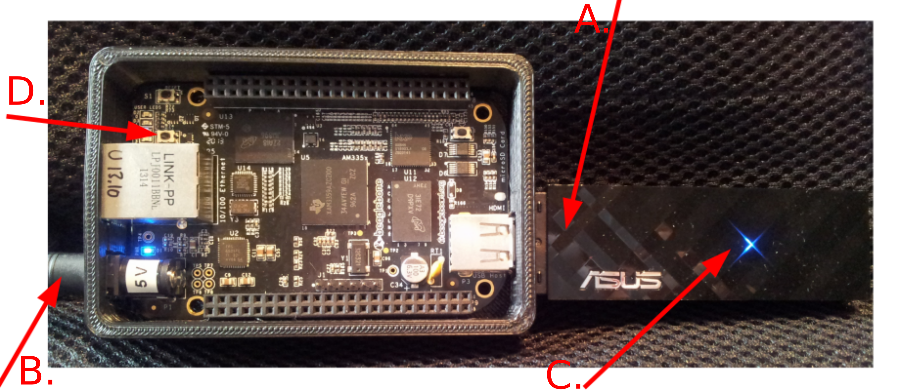

# Testing the BBB

Source: [https://github.com/nylander/BBB](https://github.com/nylander/BBB)

## Parts

* BBB computer with case
* Power adapter (Output: 5V, max 3A)
* Wifi-adapter (Asus USB-N53)

## Testing

1. Insert WiFi-adapter in the USB slot (**Fig. 1: A.**). It is important it's inserted as far as possible.

2. Plug in the power cord (**Fig. 1: B.**) and wait about 45 sec.
The BBB should boot automatically, and the blue LED (**Fig. 1: C.**) on the WiFi dongle 
should blink every 5 secs.

3. Then use a laptop or mobile phone to look for a WiFi with SSID **Mr.Black**

4. If **Mr.Black** is visible, try to connect (DHCP, no "security", no password needed).
Any connected device should get an IP in the series `10.0.0.N`, where `N > 1`.

5. Open a web browser and try to open URL [http://10.0.0.1](http://10.0.0.1)

6. If you see a web page on the BBB, then all is good.

7. If you cannot see a **Mr.Black**, try to shut down (see below), and try again.

## Shut down

Shut down by pressing the tiny black "S3 Power" button (**Fig. 1: D.**) for 5-10 sec.
All blue LEDs should switch off, then you can disassemble the BBB.
